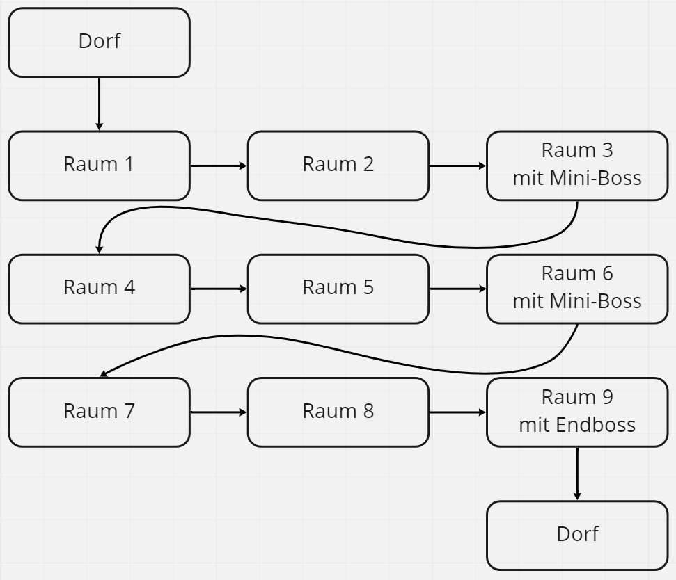
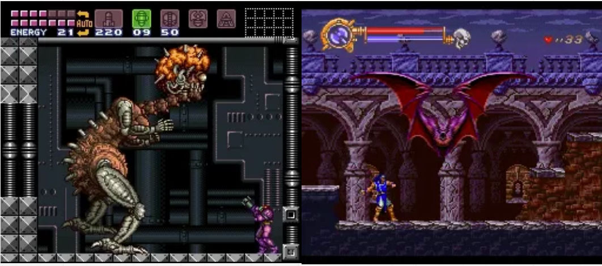
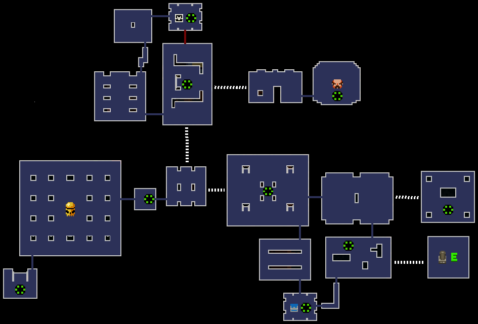

# Kampfsystem

Die Basis des Kampfsystems bildet die Schwertattacke. Ein einfacher Angriff verursacht Schaden unmittelbar vor der Heldin mit einer leichten Verzögerung nachdem die entsprechende Taste (Linksklick) gedrückt wird. Der Spieler kann das Schwert zu jederzeit verwenden. Ein Angriff mit dem Schwert kann nur durch springen nach Linksklick unterbrochen werden. Der Spieler bekommt dabei eine entsprechende Animation.

# Aufbau eines Gebiets

Ein Gebiet besteht aus insgesamt neun Räumen. In den Räumen 1, 2, 4, 5, 7 sowie 8 befinden sich nur normale Gegner mit maximal einer besonderen Fähigkeit. Die Räume 3 und 6 besitzen zusätzlich auch noch Mini-Bosse, welche eine stärkere Version eines normalen Gegners sind. Diese heben sich klar durch ihre Größe zu ihren normalen Gegenstücken ab, sodass sie intuitiv als stärker wahrgenommen werden. In dem letzten Raum, Raum 9, tritt der Spieler gegen des Endboss des Gebiets an, welcher signifikant stärker als die Mini-Bosse ist. Diese besitzen einzigartige Sprites, heben sich dadurch noch stärker von den normalen Gegnern ab. Insgesamt besitzt unser Spiel 5 Gebiete deren Schwierigkeit mit jedem Gebiet merkbar steigt.

***Abbildung :*** Aufbau eines Gebiets

# Kampf mit dem Gebiets-Endboss

Die Bosskämpfe orientieren sich stark an dem Metroidvania Genre. Der Boss befindet sich alleine in einem Segment des Raumes. Der Aufbau dieses Segments ist immer gleich. So kann der Spieler durch mehrfaches wiederholen eines Kampfes diesen Meistern. Doch auch ein Wiederholungs-Wert ist hier gegeben, da, je nach dem mit welcher Fähigkeit der Spieler den Raum des Bosses betritt, der Kampf unterschiedlich angegangen werden kann. Auch sind die Bosse so konzipiert, dass bestimmte Fähigkeiten mehr oder weniger nützlich sind. 

***Abbildung :*** Bossampf in Metroid(links) und Castlevania (rechts).[5][6] 

Die Struktur eines Kampfes ist mehrphasig. Abhängig von entweder der Zeit oder den HP des Bosses, wechselt dieser die Phase. Jede Phase hebt sich dabei stark von den anderen ab. Alle oder nur bestimmte Phasen können sich zyklisch wiederholen. 

### Beispielhafter Ablauf eines Bosskampfes
So kann ein Boss zum Beispiel in Phase 1 alleine gegen den Spieler Kämpfen und nur mit einem Standartangriff angreifen. Nach 30 Sekunden wechselt er die Phase. In einer kurzen Zwischenphase in der der Boss nicht angreifbar ist, beschwört er seine Handlanger. In der Phase 2 erscheinen 3 Mobs, die nur diesem Bosskampf treten und etwas schwächer als Mini-Bosse sind. Diese Phase endet erst, wenn alle Mobs getötet wurden. Der Boss ist nur im Hintergrund sichtbar, wie er eine Waffe zusammenbaut. In Phase 3 kann er diese nun verwenden und besitzt nun einen stärkeren Angriff. nach 45 Sekunden geht die Waffe kaputt und man befindet sich wieder in Phase 1. Die drei Phasen wiederholen sich, bis der Boss besiegt wurde oder natürlich bis der Spieler keine HP mehr übrig hat.

### Belohnung
Der Spieler wird für das Besiegen des Bosses mit einem Dorfbewohner belohnt. Durch diesen erhält er dauerhaft einen starken Buff. Nur die Dorfbewohner mit den stärksten Verbesserungen werden nach einem Bosskampf gefunden.

# Prozedurale Levelgeneration

Das offensichtlichste Element ist dabei sicherlich die prozedurale Levelgeneration die alle Spiele dieses Genres definiert. Die Level werden aus unterschiedlichen Räumen zusammengesetzt, wobei die Zusammensetzung in jedem Run unterschiedlich ausfällt. Vergleichbar ist die Levelgeneration mit dem Spiel [Enter the Gungeon](https://store.steampowered.com/app/311690/Enter_the_Gungeon/) mit dem Unterschied, dass sich zwischen den Räumen keine Gänge befinden. Man gelangt direkt von Raum zu Raum. 

***Abbildung 4:*** Layout einer Ebene in Enter the Gungeon. Verschiedene Räume Bilden eine Stage [3]

Auch befinden sich die Räume unseres Spiels in einer höheren Größenordnung. So bildet eine Ebene aus Enter the Gungeon in etwa die Größe eines Raumes ab. Jeder Raum befindet sich in einer Scene. Die Auswahl der Levelvariante, die letzten Endes gespielt wird, geschieht im Levelloader. Ziel ist es, das im fertigen Spiel kein Run dem anderen gleicht. Auch soll in einem Run die selbe Levelvariation nie mehr als einmal vorkommen. Die Levelvariationen enthalten sowohl die Umgebung (das eigentlich Level) als auch alle Gegner, weswegen zwischen Varaitionen mit normalen Gegnern und Leveln mit Mini-Bossen unterschieden wird. Der letzte Raum eines Gebiets ist jedoch immer gleich, um dem Spieler das meistern des Bosskampfes zu ermöglichen.

Die Demoversion enthält nur ein Gebiet, deren Setting das eines Friedhofs ist. Auch wird nur der mittlere Teil eines Gebiets, die Räume 4,5, und 6, vorhanden sei.

# Dorf
Das Dorf dient als Basis für den Spieler. Nachdem ein Dorfbewohner gerettet wurde, taucht dieser im Dorf auf. Er erhält dann einen Bonus, der Abhängig von dem jeweiligen Dorfbewohner ist. So gibt es zum einen allgemeine Boni, die zum Beispiel die HP oder den allgemein verursachten Schaden erhöhen. Zum anderen gibt es auch Boni, die bestimmte Fähigkeiten stärker machen oder Cooldowns reduzieren. Die erste Stufe wird freigeschalten, wenn der Dorfbewohner gerettet wurde. Diese Boni können Anschließend verstärkt werden, wenn man Aufgaben für die Bewohner erfüllt. 
Auch zeigt es den Fortschritt des Spielers. Sollte der Spieler sterben, verändert sich das Dorf nicht. Alle Dorfbewohner bleiben erhalten und auch deren Boni bleiben bestehen.  

# Tod
Sobald der Spieler stirbt, gelangt er zurück in das Dorf. Alle Fortschritte gehen dabei verloren, abgesehen von den geretteten Dorfbewohner. Diese bleiben im Dorf stehen, wodurch auch deren Verbesserungen erhalten bleiben. Auch die Fähigkeit wird zurückgesetzt. 