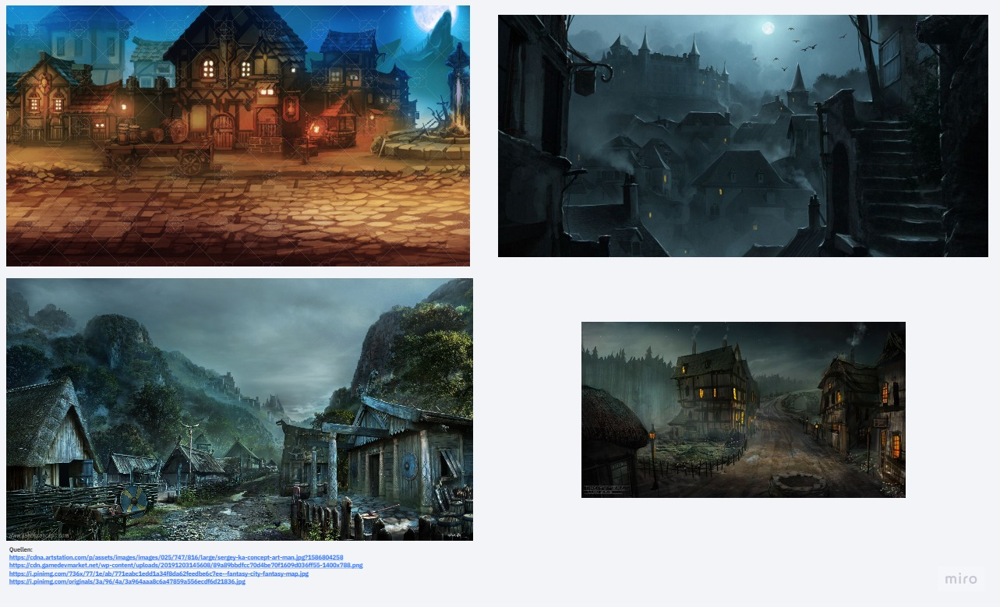
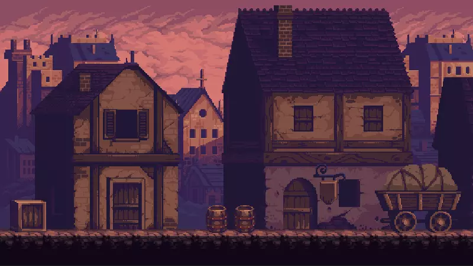
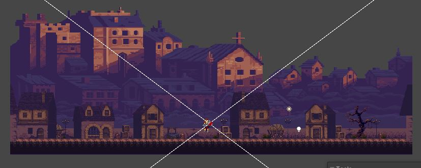

## Moodboard für das Dorf
Die Grundlegen-Stimmung des Spiels ist eine düstere und finstere, doch für das Dorf, die Hub des Spiels, soll die Stimmung ein bisschen anders sein. Zu Beginn ist das Dorf komplett leer und keine Menschenseele ist vorzufinden, dadurch soll ein bedrückendes Gefühl aufkommen, da man ganz alleine ist. Doch je länger man das Spiel spielt, füllt sich das Dorf mit Dorfbewohnern, welche man unterwegs findet. Das Dorf soll also gleichzeitig eine düstere Stimmung und eine einladende Stimmung, da man hier immer wieder zurückkehrt, bieten. Aus diesen Überlegungen ist folgendes Moodboard enstanden.

Auf Grundlage des Moodboards haben wir uns für folgendes Asset-Paket entschieden

__Quelle:__ [GothicVania Town](https://assetstore.unity.com/packages/2d/characters/gothicvania-town-101407)

## Erster Entwurf für das Dorf

# Gerettete Dorfbewohner
Im Dorf erscheinen bereits gerettete Dorfbewohner, welche dem Player Charakter verschiedene Boosts auf die von den Gegnern übernommene Fähigkeiten geben. Hier sind die Details zu den
[Dorfbewohnern](https://git.thm.de/lsfr62/gddpl/-/wikis/Dorfbewohner) zu finden.

# Funktionen des Dorfs
Das Dorf dient als Startpunkt und der Spieler kann sich beim Betreten des Portals am rechten Bildschirmrand auf neue Abenteuer begeben. Außerdem ist es dort möglich mit den geretteten Dorfbewohnern zu interagieren.

