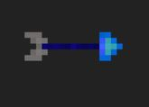

Das übernehmen von Fähigkeiten ist ein Grundstein des Kampfsystems. Sobald ein Gegner mit einer Besonderen Fähigkeit besiegt wurde, wird diese übernommen. Allerdings kann der Spieler nicht mehr als eine Fähigkeit besitzen. Nur durch gezieltes Ausschalten der Gegner in einer bestimmten Reihenfolge nimmt der Spieler Einfluss, welche Fähigkeit er zu welchem Zeitpunkt besitzt. Dabei ist der Fokus auf mehreren Einzelbegegnungen bzw. Konfrontationen mit kleinen Gruppen aus maximal 3 Gegnern. Diese können unter sich aber durchaus drei verschiedene Fähigkeiten besitzen. Nach der Übernahme verändert der Charakter sein aussehen ähnlich wie in der Kirby-Reihe und es erscheint in der UI unterhalb des HP-Balkens ein Symbol welches Auskunft über die aktuelle Fähigkeit geben soll. Sobald der Spieler einen Standardgegner ausschaltet verliert er seine Fähigkeit bis er erneut einen Gegner mit Spezialfähigkeit besiegt. Damit die verschiedenen Fähigkeiten nicht ausgenutzt werden können werden sie mit passenden Cooldowns versehen.

***Abbildung 3:*** Kirby mit verschiedenen Fähigkeit. Das Aussehen von Kirby verändert sich entsprechend der Fähigkeit, die Kirby momentan besitzt.[4]

# Implementierte Fähigkeiten 

## Feuerball

Der Feuerball kann von dem Spieler und von dem Wizard verschossen werden. Wird der Feuerball vom Wizard verschossen, bewegt er sich in die Richtung in die er geschossen wurde geradlinig an der X-Achse. Verschießt der Spieler den Feuerball, besitzt der Feuerball eine ballistische Flugbahn. Außerdem kann der Spieler einen Feuerball nur dann verschießen, wenn der zuvor verschossenen bereits explodiert ist. Sobald er an einem Objekt ankommt, welches ein „Stopping Layer“ oder „Target Layer“ hat explodiert dieser. Handelt es sich bei dem Objekt um ein „Target Layer“, versucht der Feuerball schaden in höhe des „Damage“ Wertes in einem gewissen Radius der „Damage Range“.

 

## Pfeil & Bogen

Der Spieler und der Archer können Pfeile verschießen. Der Spieler erhält diese Fähigkeit sobald er einen Archer besiegt hat. Der Pfeil fliegt gerade in Blickrichtung, bis er auf ein "Stopping Layer" oder ein "Target Layer" auftrifft. Wenn es sich bei dem getroffenen Layer um ein "Target Layer" handelt verursacht der Pfeil den im Arrow-Skript gesetzten "Damage" als Schaden am Ziel und der Pfeil wird zerstört. Wenn es sich bei dem getroffenen Layer um einen "Stopping Layer" handelt wird der Pfeil zerstört. Der Spieler kann nicht beliebig schnell Pfeile verschießen sondern muss einen Cooldown abwarten, der durch bestimmte gerettete Dorfbewohner verkleinert wird.

 

# Weitere Fähigkeiten

## Dash

Der Spieler kann sich horizontal eine gewisse Distanz schnell Bewegen. während der Bewegung kann der Spieler keinen Schaden bekommen. Bewegt er sich dabei durch einen Gegner wird diesem Schaden verursacht. Damit der Spieler nicht unverwundbar durch das Spiel gesammte Spiel dashen kann hat die Dashfähigkeit einen Cooldown.

## Stampfen

Der Spieler Stampft auf den Boden und verursacht allen Gegner in einem bestimmten Umkreis Schaden und kickt diese in die Luft.

## Teleport

Der Spieler kann sich zu einem Punkt in einer gewissen Distanz Teleportieren. Der Teleport muss für eine Kurze Zeit aufgeladen werden. Während des Aufladens kann der Spieler nicht Angreifen aber attackiert werden.