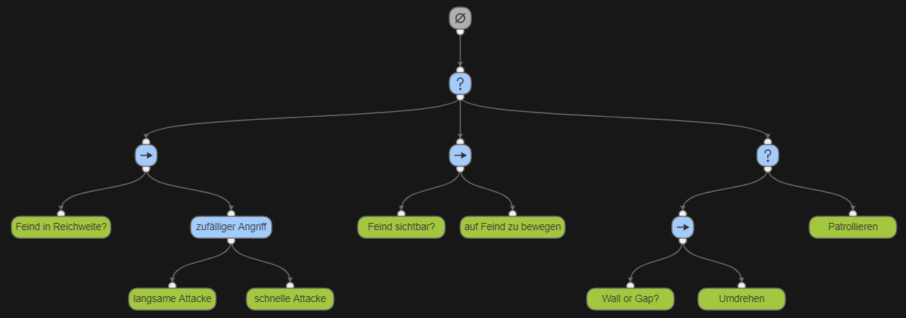
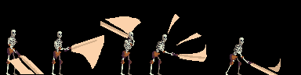

## Skelett
Das Skelett ist der Standardgegner ohne besondere Fähigkeiten. Es kämpft im Nahkampf mit einem Schwert.

### Bewegung
Zunächst patrolliert das Skelett immer einen gewissen Bereich. Die Größe des Bereichs hängt vom Level ab. Das Skelett bewegt sich in eine Richtung, bis es auf ein Hindernis trifft. Dann dreht es sich herum und bewegt sich in die entgegengesetzte Richtung. Ein Hindernis ist ein Objekt, dass den Weg versperrt oder ein Loch im Boden. Sofern es den Spieler vor sich sieht geht es weiter auf den Spieler zu und versucht diesen anzugreifen. Das Skelett erkennt den Spieler hinter sich nicht.

##### Konfiguration
**MovementSpeed**: Geschwindigkeit mit dem sich das Skelett fortbewegt

**Obstacles**: Definiert mit welchen Layern eine Kollision geprüft werden soll

**ScanPoint**: Teil des Prefabs. Das Skelett hat diesen Punkt an einer festen Position relativ zum Körper. Dieser wird genutzt, um auf Hindernisse bzw. keinen Boden zu Prüfen.

**AttackPoint**: Teil des Prefabs. Von diesem Punkt aus wird bestimmt, ob ein Angriff getroffen hat oder nicht. 

**Vision**: Reichweite in der das Skelett den Spieler sehen kann.

**Range**: Sobald der Spieler in dieser Distanz ist wird ein Angriff ausgeführt.

**AttackCooldown**: Mit diesem Wert wird konfiguriert wie lange das Skelett warten muss, bis es den nächsten Angriff starten kann.

### Kampf
In einem Bereich vor sich erkennt das Skelett den Player Charakter. Sofern das passiert bewegt es sich auf diesen zu greift mit dem Schwert an. Das Skelett hat zwei verschiedene Angriffe zur Auswahl. Eine schnelle und eine langsamere Attacke. Zwischen beiden Attacken wird zufällig entschieden. 

#### langsame Attacke
Diese Attacke ist ein Überkopfhieb. Der Spieler sieht klar, wann das Skelett diese anfängt.

#### Behaviour Tree

##### Konfiguration

**Attack Speed Slow**: Geschwindigkeit der Attacke. Je höher der Wert ist, desto schneller wird die Attacke ausgeführt.

**Damage Slow**: Schadenswert der Attacke

#### schnelle Attacke
Diese Attacke ist ein Hieb vor sich. Auch hier sieht der Spieler wie das Skelett ausholt. Es ist eine etwas schnellere Attacke mit entsprechend weniger Schaden.

##### Konfiguration

**Attack Speed Fast**: Geschwindigkeit der Attacke. Je höher der Wert ist, desto schneller wird die Attacke ausgeführt.

**Damage Fast**: Schadenswert der Attacke

## Fire Wizard
Der Wizzard ist ein Magier in einer Dunklen Gestalt, welche von einem Lila Umhang bedeckt wird. Er verfolgt den Spieler und hält dabei aber auch Abstand. Er greift den Spieler mit einem Feuerball an.  

### Behaviour
Der Wizard verfolgt den Spieler bis zu einem gewissen Abstand der „Stopping Distance“, welche im inspector eingestellt werden kann. Bewegt sich der Spieler in die Richtung des Wizzard, wird dieser sich zurückziehen wenn der Spieler die“Retreat Distance“ überschreitet. Sobald sich der Wizzard für eine gewisse Zeit in der „Stopping Distance“ befindet, schießt dieser einen Feuerball in Richtung des Spielers. Während des Schießens befindet sich der Wizzard in eine Schieß-Animation, welche etwas länger andauert. Der Spieler kann dies ausnutzen um sich dem Wizzard zu nähern und angreifen, da der Wizzard ansonsten immer Abstand zum Spieler hält. An Wänden bleibt der Wizzard stehen, was auch eine gute Möglichkeit ist als Spieler den Wizzard anzugreifen.

## Archer

 

### Verhalten

Der Archer patrouilliert mit einer eingestellten Bewegungsgeschwindigkeit auf einem walkable Layer (Boden). Sobald der Archer an eine Wand oder einen Vorsprung kommt kehrt er um und führt die Patrouillie fort. Sobald der Spieler in den eingestellten Sichtbereich (Vision) des Archer kommt fängt dieser an Pfeile im eingestellten Bulletspawnintervall auf den Spieler zu schießen. Während der Archer schießt kann er nicht laufen. Sobald der Spieler dem Archer zu nahe kommt (näher als die eingestellte minimum Distanz zum Spieler) ändert der Archer seine Richtung und läuft vom Spieler weg, bis die eingestellte Entfernung zwischen Spieler und Archer hergestellt ist (Run Distance).  Wenn dieser erreicht ist dreht sich der Archer wieder um und schießt auf den Spieler, falls dieser sichtbar ist. Wenn der Spieler nicht mehr sichtbar ist startet der Archer seine Patrouille in die Richtung in der der Spieler zuletzt gesehen wurde.

### Der Pfeil
Die Pfeile werden im eingestellten Bulletspawnintervall verschossen und fliegen gerade in Blickrichtung des Archer. Sie fliegen bis sie den Spieler oder ein Hindernis treffen. Der Arrow zieht dem Spieler Lebenspunkte ab. Der Schaden den ein Arrow macht kann im ArrowPrefab geändert werden.

## Lanzenträger

#### Verhalten

Der Lanzenträger Patrouilliert ein kleines Gebiet im Dungeon. Dabei bewegt er sich sehr langsam hin und her. Sobald der Spieler sich ihm auf eine bestimmte Distanz genähert hat, greift er den Spieler an. Dazu bereitet er den Angriff erst eine kurze Zeit vor. Dies wird durch eine Animation verdeutlicht. Er kann sich während des Vorbeireitens weder Bewegen noch Angreifen. Anschließend Dasht er auf den Spieler zu und verursacht Schaden, wenn die Spitze seiner Lanze den Spieler trifft. Der Dash ist eine fortlaufende Bewegung in eine Bestimmte Richtung (Die Richtung durch den Punkt, an dem der Spieler zum Zeitpunkt direkt nach der Vorbereitung des Angriffs). Der Dash wird, falls der Spieler dem Lanzenträger schaden verursacht, abgebrochen. Nach dem er einen Dash ausgeführt hat, kann er für eine bestimmte Zeit nicht mehr angreifen. Er versucht, den Spieler auf Abstand zu halten, bis er wieder angreifen kann.

**Hinweis:** Der Lancier ist nicht im Prototypen vorhanden.

__Quelle:__ [Hero and Opponents](https://assetstore.unity.com/packages/2d/characters/hero-nad-opponents-animation-140776)

# Mini Boss
Für den Prototypen wurde als Mini Boss der Magier und sein Feuerball vergrößert.