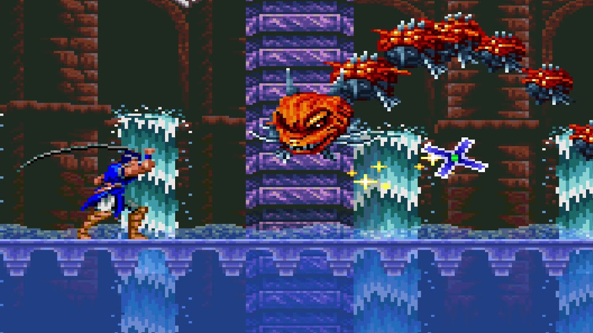
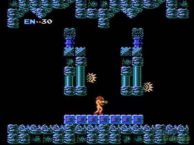

## Einleitung

Ohne Erinnerungen wachst du in einem verlassenen Dorf auf. Der einzige Weg aus dem Dorf führt durch einen Friedhof dessen Bewohner dich nicht gerade freundlich begrüßen. Zum Glück hast du ein Schwert, mit dem du dich verteidigen kannst. Ziemlich schnell stellst du fest, dass dein Schwert nicht deine einzige Waffe ist und erfährst auch, dass die Bewohner des Dorfes nicht freiwillig gegangen sind und sich noch in der Nähe befinden. Nachdem du einige befreit hast ergibt sich mehr und mehr ein Bild, wer du bist, was deine Aufgabe ist und was eigentlich passiert ist.

Das Spiel ist ein Rogue-like 2D-Sidescroller, in dem man die Fähigkeiten der getöteten Gegner übernimmt. Diese Fähigkeiten können sich sowohl auf das Movement als auch auf den Kampf beziehen. Der Ausgangspunkt für jeden Run ist ein verlassenes Dorf, das man im Verlauf des mit geretteten Bewohnern füllen kann. Die Bewohner können in den verschiedenen Stages gefunden werden und geben Boosts auf die verschiedenen Fähigkeiten. Das Dorf ist persistent. Das Spiel richtet sich hauptsächlich an Achiever.

**Hauptmerkmale:** 

Das Übernehmen der Fähigkeiten von besiegten Gegnern.\
Prozedurale Levelgeneration \
Quasi-Permadeath

## Core Loop

`Stage betreten`

`Gegner besiegen`

`Fähigkeit übernehmen`

`Boss besiegen`

`Einwohner einsammeln`

`Stage verlassen`

## Gameplay

Das Kampfsystem des Spiel orientiert sich dabei an Spielen des Metroidvania-Genre, zum Beispiel [Castlevania](Castlevania%20%E2%80%93%20Wikipedia) oder [Metroid](Metroid%20%E2%80%93%20Wikipedia). Der Spieler besitzt einen Standartangriff mit einem Schwert. Die normalen Gegner besitzen immer nur eine Angriffsfähigkeit. Neben diesen gibt es auch noch Mini-Bosse und Bossgegner. Mini-Bosse sind stärkere Versionen der Standardgegener. Bosse sind spezielle Gegner und besitzen mehrere Angriffe.

 **Abbildung 1** - Bosskampf in Castlevania \[1\]

Zusätzlich kann der Spieler die Fähigkeiten der Gegner übernehmen, ähnlich der [Kirby-Reihe](https://de.wikipedia.org/wiki/Kirby_(Spieleserie)). Der Unterschied jedoch ist, dass der Spieler diese Fähigkeit nicht aktiv auswählen kann. Er übernimmt immer die Fähigkeit des Gegners, den er als letztes Besiegt hat. Das Spiel bedient sich auch an den für das Rogue-like/Rouge-lite Genre definierenden Mechaniken des Permadeath und der prozeduralen Levelgeneration und erzeug so Spannung in jedem Run.

## Stimmung

Auch die zu Grunde liegende Stimmung orientiert sich stark an den ersten Metroidvania Titeln. Die Level sollen sich fremd und düster anfühlen, um den Gedächtnisverlust und die damit einhergehende Verwirrung abzubilden. Auch soll sich der Spieler ständig bedroht und unsicher fühlen, wodurch der Aspekt des Permadeaths hervorgehoben wird. Das Dorf soll eine fragile Sicherheit vermitteln, die mit jedem geretteten Dorfbewohner steigt. Dies dient zum betonen des Dorfes als Basis, in der der Spieler eine Pause einlegt, und hilft bei der Vermittlung von Fortschritt des Spielers.

**Abbildung 2** - Düstere Stimmung mit fremdartigen Kreaturen in Metroid. \[2\]

## Plattform und Engine
"Amnesia Skill Hunter" wird mit der Gameengine Unity für die Plattform Windows 10 entwickelt.