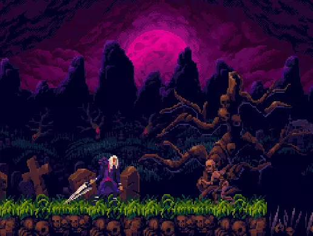
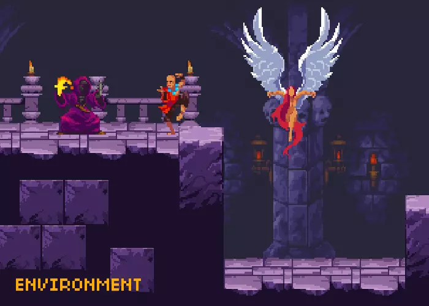
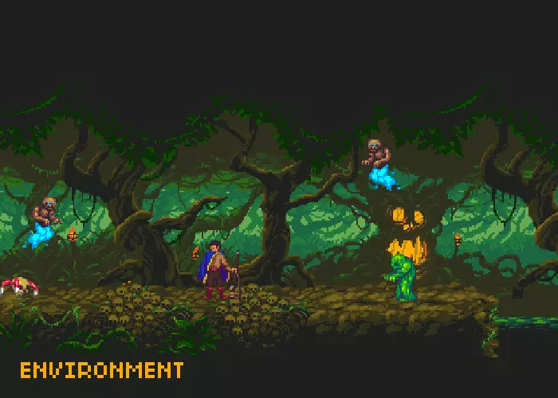

Für das Level-Design haben wir uns für ein gruseliges Konzept entschieden. Der Spieler soll dadurch nicht nur ständige Angst vor dem Tod bekommen, sondern auch Angst vor dem eigentlichen Level-Design und Gegnern bekommen. Ein bedrückendes Gefühl von Angst und Verzweiflung soll den Spieler ständig begleiten. Bevor wir uns auf die Suche nach passenden Assets gemacht haben, haben wir zuerst ein Moodboard kreiert, welches das beschriebene Stimmungsbild wieder spiegeln soll.

# Ausgewählte Asssets
Nachdem wir uns für ein grundlegendes Stimmungsbild für das Level-Design entschieden haben, haben wir uns auf die Suche nach passenden Assets gemacht und haben uns für folgende entschieden.  

## Cemetery
Das Cemetery Asset ist ein Freidhof, bei dem der Boden aus Massen von Skeletten besteht. Der Hintergrund ist mit mehreren Grabsteinen und Bäumen mit Totenkopfschädeln geziert. Aus dem Boden steigen langsam Skelette empor. 

Quelle: https://assetstore.unity.com/packages/2d/characters/gothicvania-cemetery-120509

## Church
Das Church Asset ist eine Kirche, welche schon lange von Gott verlassen wurde. Bewohnt wird die Kirche von gefallenen Engeln, Mönchen und Feuermagiern.

Quelle: https://assetstore.unity.com/packages/2d/characters/gothicvania-church-pack-147117

## Swamp
Das Swamp Asset ist ein Sumpf, welcher so dicht von Bäumen bewachsen ist, sodass man nicht einmal den Himmel oder die Sonne sehen kann. In dem Sumpf lauern gefährliche Monster, wie ein schwebender Gini, ein Spinnen ähnliche Kreatur und Sumpf-Monster.

Quelle: https://assetstore.unity.com/packages/2d/characters/gothicvania-swamp-152865

## Ende der Level

Das Ende eines Levelabschnittes wird durch ein Portal makiert. Nach Betreten gelangt man entweder in den nächsten Abschnitt oder zurück in das Dorf

## Hinweis
Dies ist nur ein vorläufiger Stand des Leveldesigns und zeigt noch nicht das endgültige Level-Design! Welche Assets es ins endgültige Spiel schaffen, stellt sich im Verlauf der Spieleentwicklung raus.