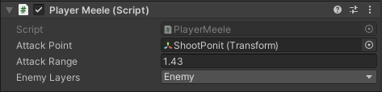

## Moodboard Player Charakter
Nach einiger Überlegung haben wir uns für einen weiblichen Hauptcharakter entschieden, da in den meisten Videospielen der Hauptcharakter ein Mann ist und wir dem etwas entgegensetzten wollten. In den meisten Videospielen werden Frauen als hilflos dargestellt und müssen von dem Spieler gerettet werden. Doch in unserem Spiel wird der Hauptcharakter als starke und unabhängige Frau dargestellt. Ganz alleine stellt sie sich starken Gegnern und bekämpft diese. Als Inspiration wurde sich für eine Schildmaid, ein weiblicher Wikinger, entschieden, da diese mit in den Kampf zieht und den männlichen Wikingern in nichts nach steht. Nach diesen Überlegungen ist folgendes Moodboard entstanden.
  

## Auswahl der Assets für den Player Charakter
Auf Grundlage des erstellten Moodboards haben wir uns für das Warrior Asset-Paket entschieden. Es enthält verschiedene Sprites von einer weiblichen Kriegerin. Diese trägt eine Rüstung und ein Schwert auf dem Rücken, mit dem sie angreifen kann. Ihr ganzes Aussehen sieht dem eines Ritters ähnlich. Das Asset enthält auch verschieden vorgefertigte Animation, wodurch ein wenig Zeit für Animator gespart werden kann.

__Quelle:__ [Warrior Free Asset](https://assetstore.unity.com/packages/2d/characters/warrior-free-asset-195707)

## Player Movement
Der Spieler kann sich mittels Eingabe der von A- oder D-Taste bewegen, wobei die Schnelligkeit mit dem "Run Speed" Parameter eingestellt werden kann. Mit der Leertaste kann der Spieler springen, hierbei können einige Einstellungen getroffen werden. Durch "Jump Height" kann die Sprunghöhe angepasst werden und durch "Low Jump Gravity Scale" und  "Falling Gravity Scale" wird die Gravitation des Spielers während des Sprungs beeinflusst. Damit der Spieler auf bestimmten Layern laufen kann, können diese bei "Walkable Layers" ausgewählt werden. Der Sprung kann mit "Time To Remember Early Jump", "Time To Remember Grounded" und "Relative Min Jump Duration" eingestellt werden.

 

## Player Shoot
Das PlayerShoot Skript ist für die Fähigkeiten des Spielers zuständig. Durch den Paramter "Cooldown" kann eingestellt werden, wie oft eine Fähigkeit ausgeführt werden kann. Mit dem Attachment "Villager" wird, sobald das Attchmend gesetzt wurde, wird der Cooldown durch den Parameter "Fac" geteilt. Das "Bullet Prefab" ist ein Attachment zu dem Feuerball, damit dieser verschossen werden kann, wenn man die Fähigkeit Feuerball bekommt. Genauso ist das Attachment "Arrow Prefab" für den Pfeil und die entsprechende Bogen Fähigkeit da. Mit dem Attachment "Shoot Point" muss der ShootPoint des Spielers attached werden, damit man von dieser Stelle der Feuerball und der Pfeil geschossen werden kann.

## Player Mellee
Der Spieler besitzt eine Mellee Angriff, mit welchen man Gegner Schaden zufügen und töten kann. Die Attacke wird durch den rechten Mausklick augelöst. Dem Script muss ein "Attack Point" zugewiesen werden, den Bereich zu bestimmen, in dem die Attacke Schaden zufügt. Die "Attack Range" bestimmt, wie weit der Angriff gehen soll, und mit "Enemy Layers" kann man einstellen, wem der Angriff Schaden zufügen soll.

## Player Health
Der Spieler besitzt eine bestimmte Anzahl an Lebenspunkte, welche in der UI angezeigt werden. Die "Progress Bar", welche man auf der UI des Spiels finden kann, muss dem Script Player Health zugewiesen werden. Die maximale Anzahl an Lebenspunkten kann in "Max Health" eingestellt werden. 

