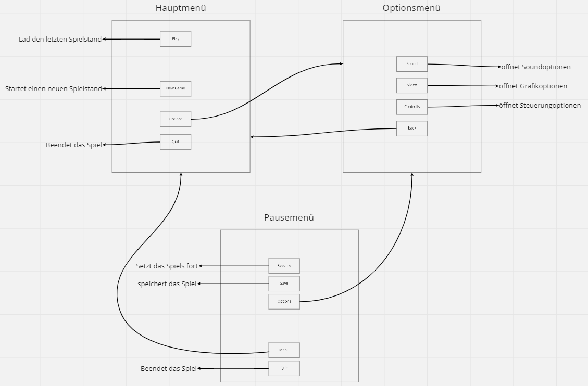
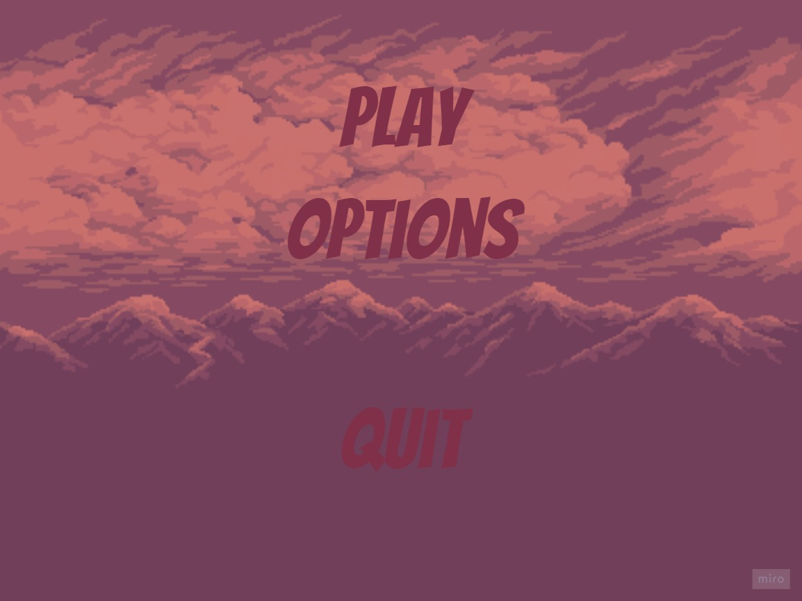
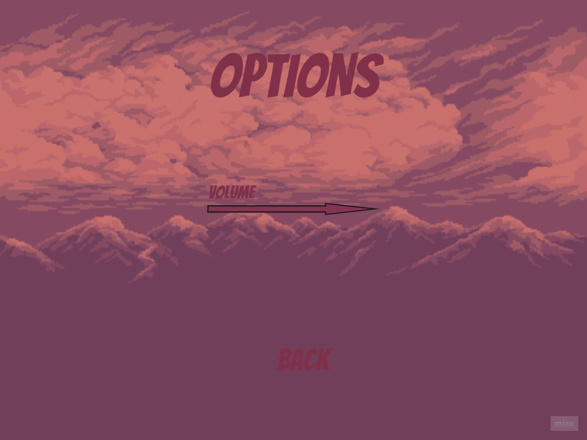
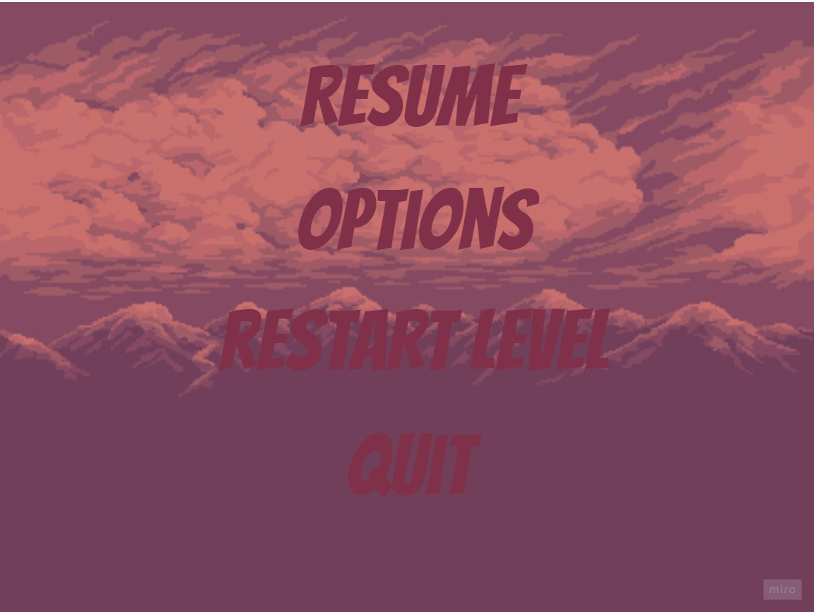
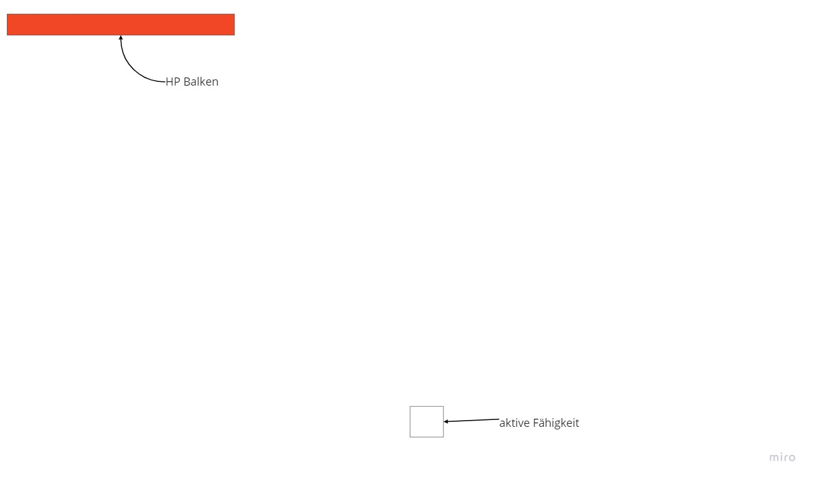
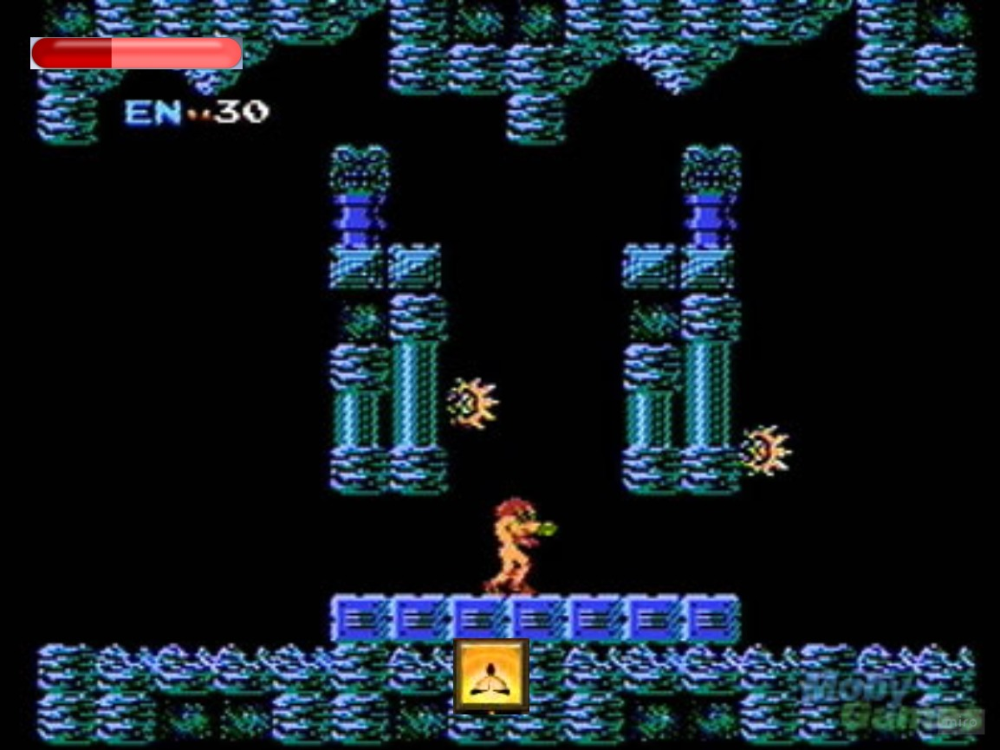
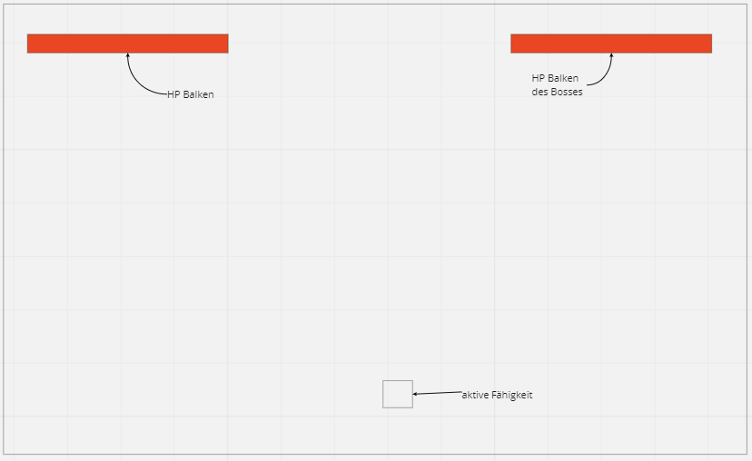

# Menü Entwurf

## Flow Chart der Menüs
Bei dem Hauptmenü soll man durch das Drücken des Play-Buttons das Spiel starten können, dabei soll der zuletzt gespeicherte Speicherstand geladen werden. Mit dem New Game Button soll man ein neues Spiel starten können. Durch das Drücken des Options Button soll man in das Options Menü kommen und mit dem Quit-Button beendet man das Spiel. Im Optionsmenü kann man mit dem Drücken des Sound-Buttons die Soundoptionen öffnen. Wenn man den Video-Button drückt, soll man in die Grafikoptionen kommen und mit dem Controll Button soll man in die Steuerungsoptionen kommen. Im Pausenmenü kann man mit dem Drücken des Resume Button das Spiel fortsetzen. Das Spiel speichern kann man mit dem Save Buttonn. Mit dem Options Button kommt man ins Optionsmenü und mit dem Menu Button gelangt man wieder in das Hauptmenü.
Wenn man den Quit Button drückt, kommt man ins Hauptmenü. 

## Hauptmenü
Das Hauptmenü in den Prototypen besitzt einen Play Button, mit dem man das Spiel starten kann, einen Options Button, mit dem man in das Optionsmenü kommt und einen Quit Button, mit dem das Spiel beenden kann.

## Optionsmenü

Im Optionsmenü den Prototypen gibt es einen Slider, mit dem die Musik-Lautstärke geregelt werden kann und ein Back Button, mit dem man ins Ursprungsmenü zurückkommt.
Wir haben uns dazu entschieden, zwei Slider zu implementieren. Einen für die Lautstärke der Musik und einen für die Lautstärke der Soundeffekte, damit man diese unabhängig voneinander einstellen kann.

## Pause Menü
Durch das Drücken der Escape-Taste wird das Spiel pausiert und das Pause Menü wird geöffnet. Es bleibt so lange geöffnet und das Spiel pausiert, bis die spielende Person die Escape-Taste erneut drückt oder den Resume-Button des Menüs drückt. Des Weiteren besitzt das Pausenmenü einen Options Button, mit dem man in das Optionsmenü gelangt, einen Restarte Level Button um das Level in dem man sich gerade befindet zu reseten, einen Quit Button, mit dem man das Spiel beendet.

# In Game UI
In der UI des Spieles gibt es oben links einen HP Balken, bei dem die aktuellen Gesundheit-Punkte des Spielers angezeigt werden, und unten in der Mitte eine Fähigkeit-Anzeige, welche die aktuelle Fähigkeit des Spielers anzeigt. 

Bei der Implementierung ist uns aufgefallen, dass es wegen der Übersicht einfacher ist, die Healthbar und die Fähigkeit-Anzeige zusammenzulegen. Wir haben uns dazu entschieden beides in der oberen linken Bildschirmecke zu platzieren.

Für die UI des Spieles wurde sich an dem Spiel Metroid orientiert.

# Ui während eines Bosskampfes
Während eines Bosskampfes kommt zusätzlich zu den Anzeigen der Game UI ein HP Balken des Bosses hinzu, welche die Lebenspunkte des Bosses anzeigt. Für den Prototypen wurde deis nicht implementiert.

