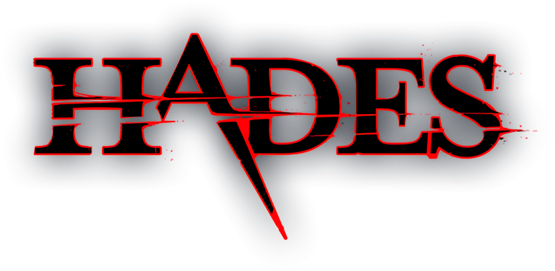

# Kirby
- Spaßfaktor: Fähigkeiten übernehemen, Story, Fantasie
- Spielertyp: Archiever 
- Mentale Grundbedürfnisse:
  - Level meistern mithilfe von springen, Fähigkeiten übernehmen und kämpfen
  - Fähigkeiten übernehmen:
    - Durch Aufsaugen der Gegner können Fähigkeiten übernommen werden
    - Es kann nur eine Fähigkeit gleichzeitig gehalten werden
    - Je nach Fähigkeit verändern sich die Attacken
    - Wenn man einmal getroffen wird, verliert man die Fähigkeit
    - Welche Fähigkeit man besitzt, wird am Charakter selber oder am Bildschirmrand dargestellt

# Hades
- Spaßfaktor: Kämpfen, Herausforderung, Story
- Spielertype: Archiever
- Mentale Grundbedürfnisse:
  - Alle Ebenen meistern
  - Story beenden
  - Beziehungen zu den Charakteren aufbauen, durch eine Ressource welche man im Kampf gewinnt
  - Rogue-Like:
    - Zufall generierte Level: zufällige Räume
    - Es gibt verschiedene Räume mit vielen verschiedenen Gegnern
    - Es gibt 4 Ebenen mit eigenem Raumdesign, eigenen Gegnern, eigenen NPCS und eigenem Boss
    - Es gibt Währung, mit denen man Verbesserungen in der Base kaufen kann
  - Fähigkeiten: 
    - Es können Fähigkeiten bei Göttern erworben werden
    - Wenn man stirbt, verliert man alle gesammelten Fähigkeiten
    - Pro Attacke kann nur eine Fähigkeit gehalten werden
    - Passive Fähigkeiten können beliebig oft kombiniert werden
    - Dadurch ist jeder Run spielerisch ein neues Erlebnis
    - Welche Fähigkeiten man besitzt, kann in einem Menü nachgeschaut werden

# Eigene Umsetzung
* Aktuelle Fähigkeit wird mit einem kleinen Bild im UI angezeigt.
* Gegner die keine Standardgegner sind haben Spezialfähigkeiten wie zum Beispiel der Bogenschütze schießt mit seinem Bogen. Sobald der Spieler den Bogenschützen ausgeschaltet hat übernimmt er die Fähigkeit Bogenschießen auf seinem Spezialattacken Slot. So wird es relevant in welcher Reihenfolge der Spieler die Gegner besiegt, da die Fähigkeit immer überschreiben wird.

