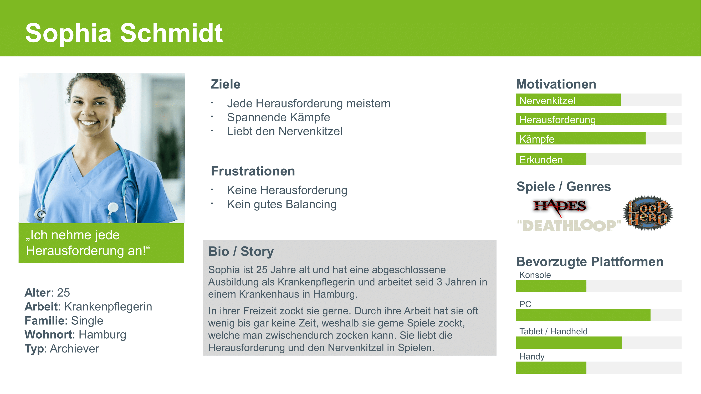

# Zielgruppenanalyse
- **Alter: 20-59** (Verteilung der Videogamer in Deutschland nach Alter im Jahr 2021 Statista. Statista GmbH. Zugriff: 27. Januar 2022. <https://de.statista.com/statistik/daten/studie/290890/umfrage/altersverteilung-von-computerspielern-in-deutschland/>)
- **Abschluss: Mittlere Reife** (Verteilung der Computerspieler in Deutschland nach Bildungsgrad im Jahr 2021. Statista GmbH. Zugriff: 27. Januar 2022. <https://de.statista.com/statistik/daten/studie/418967/umfrage/verteilung-der-computerspieler-in-deutschland-nach-bildungsgrad/> )
- **Job: Krankenpfleger**  (Bundesagentur
für Arbeit. (2021). Beschäftigte in Deutschland nach Berufsgruppen am 30. Juni 2020
(in 1.000; sozialversicherungspflichtig und geringfügig Beschäftigte). Statista. Statista
GmbH. Zugriff: 27. Januar 2022. <https://de.statista.com/statistik/daten/studie/1099494/umfrage/beschaeftigte-in-deutschland-nach-berufsgruppen/>)
- **Geschlecht: Weiblich** (So steht es um die Krankenpflege in Deutschland. Geschlechtsverteilung. Statista GmbH. Zugriff: 27. Januar 2022. <https://de.statista.com/infografik/17988/arbeitsmarktsituation-krankenpflege/> )
- **Familienstand: Ledig** (Parship. (2018). Könnten Sie sich vorstellen den Bund der Ehe mit einer/m neuen Partner/in einzugehen?. Statista. Statista GmbH. Zugriff: 27. Januar 2022. <https://de.statista.com/statistik/daten/studie/886805/umfrage/umfrage-unter-singles-zur-bereitschaft-zur-ehe-nach-altersgruppen/>)
- **Einkommen: 3.539 Euro pro Monat** (So viel verdienen Pflegekräfte in Deutschland. Statista GmbH. Zugriff: 27. Januar 2022. <https://de.statista.com/infografik/24984/medianentgelte-vollzeitbeschaeftigter-in-der-kranken-und-altenpflege/>)
- **Gerät für Videospiele: PC** (Auf welchen dieser Geräte spielen Sie regelmäßig Videospiele?. Statista GmbH. Zugriff: 27. Januar 2022. <https://de.statista.com/statistik/daten/studie/999795/umfrage/deutschland-beliebte-geraete-fuer-videospiele/>)
- **Betriebssystem: Windows 10** (Anteile der meistgenutzten Betriebssystemversionen bei Usern der Online-Vertriebsplattform Steam im Juni 2021. Statista GmbH. Zugriff: 27. Januar 2022. <https://de.statista.com/statistik/daten/studie/38766/umfrage/nutzungsanteil-der-betriebssysteme-bei-den-usern-der-plattform-steam/>)
- **Spielmotivation: Erfolgserlebnisse und Spaß** (Ich spiele Online-Games, um… . Statista GmbH. Zugriff: 27. Januar 2022. <https://de.statista.com/statistik/daten/studie/173690/umfrage/motivation-der-spieler-von-online-games/>)

## Ergebnis:
